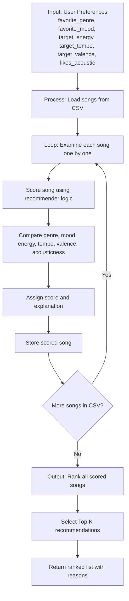

```mermaid
flowchart TD
    A[Input: User Preferences<br/>favorite_genre, favorite_mood, target_energy, target_tempo, target_valence, likes_acoustic] --> B[Process: Load songs from CSV]
    B --> C[Loop: Examine each song one by one]
    C --> D[Score song using recommender logic]
    D --> E[Compare genre, mood, energy, tempo, valence, acousticness]
    E --> F[Assign score and explanation]
    F --> G[Store scored song]
    G --> H{More songs in CSV?}
    H -->|Yes| C
    H -->|No| I[Output: Rank all scored songs]
    I --> J[Select Top K recommendations]
    J --> K[Return ranked list with reasons]
```
